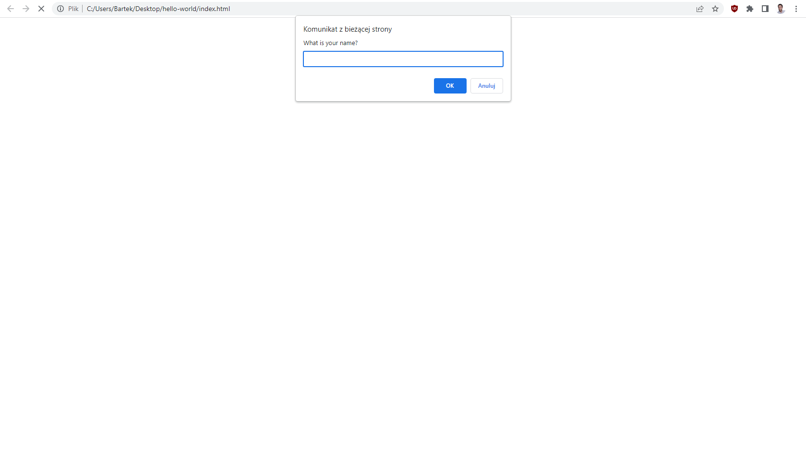

# hello-world
'Hello world' alert implementation in JavaScript.

Live demo [_here_](https://codepen.io/lisu277/full/LYXwREK).

## Table of Contents
* [Tech Stack](#tech-stack)
* [Screenshots](#screenshots)
* [Run Locally](#run-locally)
* [Project Status](#project-status)
* [Acknowledgements](#acknowledgements)
* [Authors](#authors)

## Tech Stack
- HTML
- JavaScript

## Screenshots


## Run Locally
Clone the project

```bash
  git clone https://github.com/bartlomiejlis/hello-world.git
```

Go to the project directory and open index.html file in your browser.

## Project Status
Project is: _no longer being worked on_.

## Acknowledgements
This project is based on [this tutorial](https://www.digitalocean.com/community/tutorials/how-to-write-your-first-javascript-program).

## Authors
Created by Bartłomiej Lis - feel free to contact me at lisu.b117@gmail.com!
